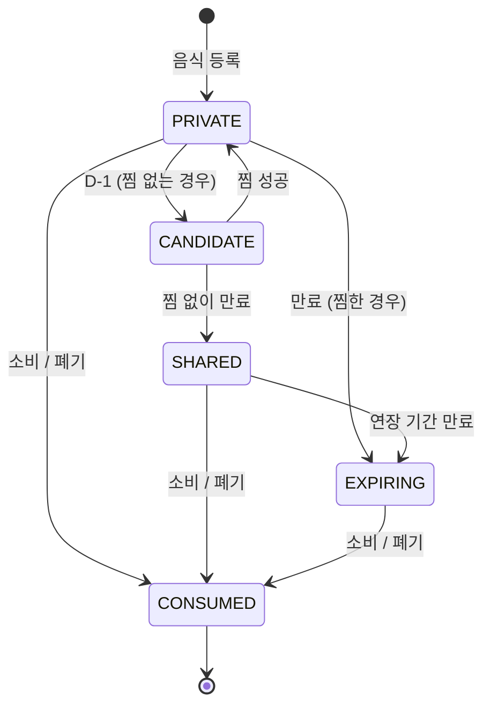
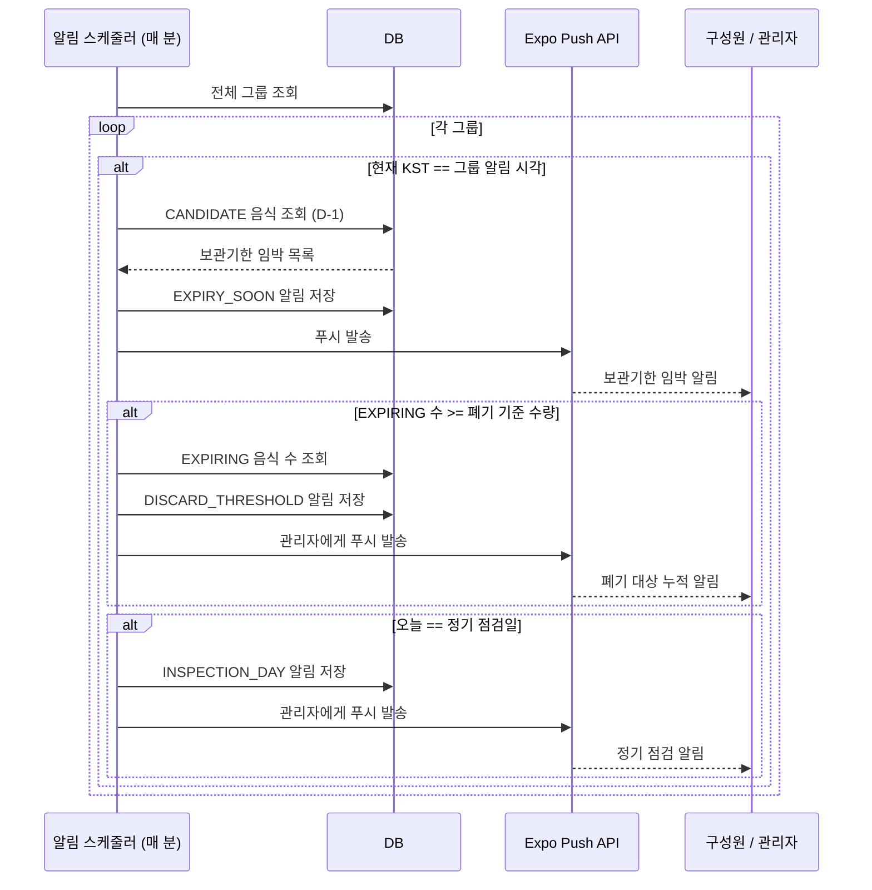

<div align="center">

  <p align="center">
    
  </p>

  # 양심냉장고
  ### 공용 냉장고 관리 서비스

</div>

---

## 목차
- [서비스 개요](#서비스-개요)
- [서비스 상세 소개](#서비스-상세-소개)
  - [핵심 기능](#핵심-기능)
  - [음식 상태 라이프사이클](#음식-상태-라이프사이클)
  - [알림 스케줄러 흐름](#알림-스케줄러-흐름)
  - [사용자 시나리오](#사용자-시나리오)
- [설계 및 구현](#설계-및-구현)
  - [소프트웨어 아키텍처](#소프트웨어-아키텍처)
  - [Repository 구조](#repository-구조)
  - [핵심 기술 스택](#핵심-기술-스택)
  - [하드웨어 구성](#하드웨어-구성)
  - [시작하기](#시작하기)
  - [DevSecOps, 배포](#devsecops-배포)
- [팀원 소개](#팀원-소개)

---

## 서비스 개요

> '양심냉장고'는 공동체 내 공용 냉장고의 효율적인 관리를 돕는 어플리케이션입니다.
>
> 사용자는 NFC 태그를 통해 편하게 라벨 스티커를 출력하여 식품에 붙이고, QR코드로 음식의 상태를 확인합니다.
>
> 음식 폐기 과정에서 공동체 구성원의 자발적 참여를 유도하여 관리자의 부담을 분산시킵니다.

| 구분 | 내용 |
|------|------|
| **Target** | **공용 냉장고를 운영하는 시설의 관리자**<br>- 대학 기숙사 · 학생 식당 운영 교직원<br>- 호스텔 · 게스트하우스 운영자<br>- 공유 오피스 · 공유 주거 관리 담당자 |
| **Problem** | - 냉장고 속 식품 상태를 **관리자 혼자 파악**해야 하는 구조적 부담<br>- 보관기한이 지난 음식이 방치되어도 **구성원은 관여하지 않음**<br>- 누가 어떤 음식을 보관 중인지 **추적이 어려움**<br>- 폐기·공지 등 관리 업무가 **관리자에게 집중** |
| **Solution** | - 구성원이 직접 음식을 등록·관리하는 **참여형 냉장고 관리 시스템**<br>- 폐기 음식을 방치하면 냉장고 이용을 제한하는 **책임 유도 메커니즘**<br>- 관리에 기여한 구성원에게 포인트를 지급하는 **보상 시스템** |

---

## 서비스 상세 소개

### 핵심 기능

**1. 그룹 생성**
<p align="center">
  
  
</p>

- 사용자는 누구나 그룹을 생성할 수 있습니다.
- 보관기한, 입/퇴실일을 설정할 수 있습니다.
- 그룹을 만든 사용자는 해당 그룹의 관리자가 됩니다.
- 자동 생성되는 초대 코드를 통해 다른 사용자들이 그룹에 참여할 수 있습니다.
- 관리자는 그룹 내 공지 게시판을 통해 구성원에게 중요한 메시지를 전달할 수 있습니다.

**2. 음식 저장**
<p align="center">
  
  
</p>

- 냉장고에 부착된 NFC 스티커에 휴대전화를 태깅하면 앱과 라즈베리파이가 연동하여 라벨 프린터에서 스티커가 자동 출력됩니다.
- 스티커에는 소유자·보관일·보관기한·QR코드가 포함됩니다.
- 라벨 출력 후 음식 상세 정보 입력 화면으로 전환되며, AI 자동 생성 기능을 활용할 수 있습니다.
- 본인 소유의 폐기 대상 음식이 남아 있으면 라벨 출력이 차단되며, 먼저 해당 음식을 소비하거나 폐기해야 합니다.

**3. 상태 확인**
<p align="center">
  
  
</p>

- QR코드 스캔으로 보관 중인 음식의 소유자·보관기한·상태를 즉시 조회합니다.
- 색깔을 이용한 직관적인 UI로 빠르게 상태를 확인하고 음식을 처리할 수 있습니다.

**4. 포인트 & 찜**
<p align="center">
  
  
</p>

- 보관기한이 하루 남은 음식은 찜 대기 상태(CANDIDATE)로 전환됩니다.
- 사용자는 포인트(3점)를 소모해 다른 사람의 음식을 찜할 수 있으며, 원 소유자가 방치하면 자정에 소유권이 이전됩니다.
- 찜하는 사람이 없으면 공용(SHARED) 상태로 전환되어 누구나 먹을 수 있습니다.
- 음식 등록·찜·폐기 처리 등 냉장고 관리에 기여할수록 포인트와 랭킹이 쌓이며, 관리자 재량하에 보상 가능합니다.

**관리자 전용 기능**

| 기능 | 설명 |
|------|------|
| **폐기 임박 알림** | 그룹 내 폐기 대상 음식이 설정한 기준 수량 이상이 되면 관리자에게 푸시 알림 발송 |
| **정기 점검일 알림** | 매달 지정한 날짜에 냉장고 점검 알림을 관리자에게 자동 발송 |
| **그룹 고급 설정** | 보관 기간·폐기 기준 수량·알림 시각(시:분)·랭킹 집계 주기 등 세부 설정 |
| **멤버 관리** | 구성원 강퇴, 역할 변경, 초대 코드 발급 |
| **운영자 페이지** | 전체 서비스 현황 조회 (앱 내 운영자 도구) |

---

### 음식 상태 라이프사이클



| 상태 | 의미 |
|------|------|
| `PRIVATE` | 본인 소유로 냉장고에 보관 중 |
| `CANDIDATE` | 보관기한 D-1, 찜 대기 상태 |
| `SHARED` | 찜하는 사람이 없어 공용 전환된 상태 |
| `EXPIRING` | 보관기한 만료, 폐기 대상. 이 상태인 음식이 있으면 새 음식 등록 불가 |
| `CONSUMED` | 소비 또는 폐기 완료 |

---

### 알림 스케줄러 흐름

스케줄러가 그룹별 설정 시각과 현재 시각을 비교해 알림을 발송합니다.



---

### 사용자 시나리오

#### 관리자 시나리오 (예: 기숙사 사감)

**처음 그룹 생성**
1. 회원가입 및 로그인을 한다.
2. 그룹 생성 버튼을 누르고 기본 설정을 한다. (예: 기숙사 입사일, 퇴사일, 음식 보관기한 등)
3. 생성된 초대 코드를 기숙사 학생들에게 전달한다.
4. 그룹 내에 냉장고를 생성하고, 라즈베리파이와 연동시킨다.
   - 라즈베리파이와 스마트폰이 **같은 와이파이**에 연결된 상태에서 앱 → 그룹 설정 → 기기 연동으로 이동
   - 라즈베리파이의 **로컬 IP 주소**를 입력하고 등록 → "등록되었습니다" 확인
   - 라즈베리파이 **전원을 껐다가 켜기** → 부팅 시 Cloudflare Tunnel이 자동 실행되며 EC2에 터널 주소가 등록됨
   - 이후 와이파이가 달라져도 앱 ↔ 라즈베리파이 통신 가능
5. NFC 스티커에 냉장고 정보를 저장한 후 냉장고 옆에 부착하고, 라벨 프린터를 냉장고 옆에 둔다.

**평상 시**
1. 관리자 페이지를 통해 전체 상품의 상태를 확인한다.
2. 중요한 공지사항이 있을 경우 공지 게시판에 글을 작성한다.
3. 필요한 경우 일반 사용자에게 관리자 권한을 부여하거나 부적절한 사용자를 강퇴시킨다.

**정기 점검일**
1. 미리 앱에 설정해 둔 정기 점검일 당일에 알림을 받는다.
2. 냉장고 앞으로 이동해서 앱을 켜고 QR 스캔 화면을 대기한다.
3. 식품에 부착된 라벨 스티커의 QR 코드를 스캔하고 폐기해야 할 상품을 빠르게 폐기한다.

#### 참가자 시나리오 (예: 기숙사 학생)

**처음 그룹 참여**
1. 회원가입 및 로그인을 한다.
2. 그룹 참여 버튼을 누르고 전달받은 초대 코드를 입력한다.
3. 자신의 정보를 입력하고 그룹에 참여한다.

**음식 저장**
1. 음식을 넣으려는 냉장고에 부착된 NFC 스티커를 휴대폰으로 태깅한다.
2. 앱 화면이 열리면 라벨 출력을 대기한다.
3. 출력된 라벨 스티커를 자신의 음식에 붙이고 냉장고에 넣는다.
4. 라벨 출력이 완료되면 음식 상세 정보 입력 화면으로 전환된다. AI 자동 생성 기능을 활용할 수 있다.

**평상 시**
1. 냉장고 페이지에서 "음식", "폐기 대상", "공용", "찜 리스트" 카테고리를 선택할 수 있다.
2. 먹은 음식을 폐기 처리하거나 포인트로 보관기한을 연장할 수 있다.
3. "찜 리스트"에서 보관기한이 하루 남은 음식을 포인트를 이용해 찜할 수 있다.
4. 찜한 음식의 원 소유자가 방치하면 자정에 소유권이 넘어온다.

---

## 설계 및 구현

### 소프트웨어 아키텍처

<p align="center">
  
</p>

- **Presentation Layer**
  - **App (Root Component)** : 모바일 애플리케이션의 진입점으로, 전체 화면 구조와 전역 상태를 관리
  - **Navigation Module** : 화면 간 이동 및 내비게이션 흐름을 관리
  - **Auth Module** : 로그인/회원가입 처리, JWT 저장 및 인증 상태 관리
  - **Fridge Module** : 식품 목록 조회, 등록, 삭제 기능 제공
  - **Group Management Module** : 그룹 생성, 그룹 정보 관리, 멤버 관리 기능 제공
  - **Notification Module** : 알림 목록 조회 및 UI 표시 기능 제공
  - **NFC Module** : NFC 태그 인식 및 특정 냉장고 컨텍스트로의 진입 기능 제공

- **Business Layer**
  - **Auth Service** : 사용자 인증, JWT 발급 및 검증 기능 담당
  - **User/Group Service** : 사용자 정보 관리, 그룹 생성·조회·멤버 관리 담당
  - **Food/Fridge Service** : 식품 등록·조회·삭제 및 냉장고 핵심 비즈니스 로직 처리
  - **Notification Service** : 알림 생성 및 Expo Push API 연동을 통한 푸시 알림 전송 담당
  - **Print Service** : 식품 등록 시 라벨 출력 요청 생성 및 상태 관리 담당
  - **Device Integration Service** : Cloudflare Tunnel을 통한 라즈베리파이 연동 로직 담당

- **Persistence Layer**
  - **User / Group / Food / Fridge Repository** : 각 도메인 데이터 접근 및 CRUD 담당
  - **Notification Repository** : 알림 데이터 접근 및 CRUD 담당

- **Data / External Integration Layer**
  - **MySQL** : 사용자, 그룹, 식품, 알림 등 서비스 운영 데이터 저장
  - **AWS S3** : 식품 이미지, 프로필 이미지 등 업로드 파일 저장
  - **Firebase Cloud Messaging** : 사용자 디바이스에 푸시 알림 전송
  - **Raspberry Pi Gateway** : 서버의 출력 명령을 수신하여 라벨 프린터에 전달하는 중간 장치

---

### Repository 구조

```
Nangjanggo/
├── .github/workflows/                  # GitHub Actions CI/CD 설정
│   ├── backend.yml                     # 백엔드 자동 배포 워크플로우
│   └── frontend.yml                    # 프론트엔드 자동 배포 워크플로우
│
├── backend/                            # Spring Boot 백엔드 서버
│   └── src/
│       ├── main/
│       │   ├── java/com/nangjanggo/yangsim/
│       │   │   ├── admin/              # 운영자 전용 API (전체 유저/그룹/음식 조회)
│       │   │   ├── auth/               # 회원가입, 로그인, 이메일 인증
│       │   │   ├── community/          # 게시글, 댓글, 좋아요
│       │   │   ├── dev/                # 개발 전용 엔드포인트 (@Profile("dev"))
│       │   │   ├── exception/          # 예외 처리
│       │   │   ├── food/               # 식재료 CRUD, AI 분석, 상태 스케줄러
│       │   │   ├── fridge/             # 냉장고 CRUD
│       │   │   ├── group/              # 그룹 생성/참여/멤버 관리
│       │   │   ├── hardware/           # 라즈베리파이 연동
│       │   │   ├── notification/       # 푸시 알림
│       │   │   ├── printer/            # 라벨 프린터 출력
│       │   │   ├── ranking/            # 랭킹 및 포인트
│       │   │   ├── security/           # JWT 인증
│       │   │   └── user/               # 회원 엔티티, 마이페이지
│       │   └── resources/              # 설정 파일 및 리소스
│       └── test/
│           └── java/com/nangjanggo/yangsim/
│               └── ...                 # 서비스 및 컨트롤러 테스트 코드
│
├── frontend/                           # React Native / Expo 모바일 앱
│   ├── assets/                         # 이미지, 아이콘 등 정적 리소스
│   ├── src/
│   │   ├── core/navigation/            # 앱 전체 내비게이션 설정
│   │   ├── features/                   # 기능별 화면 및 로직
│   │   │   ├── admin/                  # 운영자 페이지
│   │   │   ├── auth/                   # 로그인, 회원가입, 비밀번호 재설정
│   │   │   ├── community/              # 게시글, 댓글
│   │   │   ├── dev/                    # 개발 도구 화면
│   │   │   ├── food/                   # 음식 등록, QR 스캔
│   │   │   ├── fridge/                 # 냉장고 및 식재료 화면, NFC 읽기
│   │   │   ├── group/                  # 그룹 관리, NFC 태그 쓰기
│   │   │   ├── home/                   # 홈 화면
│   │   │   ├── mypage/                 # 내 정보 수정
│   │   │   └── notification/           # 알림 목록
│   │   └── shared/                     # 공통 컴포넌트, 상수, 유틸
│   ├── App.js                          # 앱 진입점
│   ├── app.config.js                   # Expo 앱 설정
│   └── package.json                    # 프로젝트 의존성 및 스크립트
│
└── (Hardware) Raspberry Pi             # 라즈베리파이 기반 하드웨어 모듈 (별도 레포)
    ├── 라벨 프린터 제어 서버 (HTTP)
    ├── Cloudflare Tunnel로 외부 접속 허용
    └── NFC 태그 → 앱 딥링크 연동
```

---

### 핵심 기술 스택

<p align="center">
  
</p>

| 영역 | 기술 | 선정 이유 |
|------|------|-----------|
| Frontend | React Native, Expo | 하나의 코드베이스로 모바일 앱을 개발할 수 있으며, Expo를 통해 빌드와 테스트 과정을 간소화 |
| Backend | Spring Boot 3.4.4, Java 21 | 안정적인 서버 구조와 REST API 개발에 적합하며, 인증·DB 연동·배포 환경 구성이 용이 |
| Database | MySQL 8.0 | 사용자, 그룹, 식품, 냉장고 데이터처럼 관계형 데이터 관리에 적합하고 안정성이 높음 |
| Auth | Spring Security, JWT | 사용자 인증과 권한 관리를 체계적으로 구현할 수 있으며, JWT로 모바일 환경에서 무상태 인증 처리 가능 |
| Storage | AWS S3 | 식품 이미지와 같은 파일 데이터를 서버와 분리하여 안정적으로 저장 |
| AI | Google Gemini API | 식품 정보 분석 및 자동 생성 기능을 구현하여 사용자의 입력 부담을 줄임 |
| Push | Firebase, Expo Notifications | 보관기한·폐기 알림 등을 모바일 앱 사용자에게 실시간으로 전달 |
| Infra | Docker, AWS EC2 | Docker로 실행 환경을 일관되게 관리하고, EC2로 백엔드 서버를 클라우드 환경에서 운영 |
| CI/CD | GitHub Actions | 코드 변경 시 빌드 및 배포 과정을 자동화하여 수동 배포의 오류를 줄이고 개발 효율을 높임 |
| Hardware | Raspberry Pi, 라벨 프린터, NFC | NFC 태그와 라벨 프린터를 활용해 식품 등록 및 식별 과정을 오프라인 환경과 연동 |

---

### 하드웨어 구성

**Raspberry Pi + 라벨 프린터**를 냉장고에 연동해, 식재료 등록 시 자동으로 라벨을 출력합니다.

```
모바일 앱에서 NFC 태그 터치
        │
        ▼
Spring Boot 서버 (EC2)
  - 음식 항목 생성
  - Raspberry Pi로 출력 명령 전송 (Cloudflare Tunnel)
        │
        ▼
Raspberry Pi → 라벨 프린터
  - 출력 내용: 음식 ID / 소유자 / 보관 기간
  - QR 코드: 앱 딥링크 (yangsimfridge://foods/{id})
```

---

### 시작하기

#### 사전 요구사항

- Java 21
- Node.js 18+
- Docker & Docker Compose
- Expo CLI (`npm install -g expo-cli`)

#### 환경 변수

`backend/.env`

```env
# MySQL
DB_USERNAME=
DB_PASSWORD=
DB_ROOT_PASSWORD=

# JWT 서명 키
JWT_SECRET=

# Gmail SMTP (이메일 인증 발송)
MAIL_USERNAME=
MAIL_PASSWORD=

# AWS S3 (이미지 저장)
AWS_ACCESS_KEY=
AWS_SECRET_KEY=
AWS_S3_BUCKET=
AWS_REGION=

# Google Gemini (식재료 AI 분석)
GEMINI_API_KEY=
```

`frontend/.env`

```env
# 백엔드 서버 주소
EXPO_PUBLIC_API_URL=
```

#### 백엔드 실행

```bash
cd backend
docker-compose up --build
```

또는 로컬에서 직접 실행:

```bash
cd backend
./gradlew bootRun
```

#### 프론트엔드 실행

```bash
cd frontend
npm install
npx expo start
```

---

### DevSecOps, 배포

#### CI/CD 파이프라인

`main` 브랜치에 push하면 변경된 영역(backend / frontend)에 맞는 워크플로우가 자동으로 실행됩니다.

**백엔드 (`backend/**` 변경 시)**

```
push to main
  │
  ├─ [test]  Gradle 테스트 + JaCoCo 커버리지 측정 → Codecov 업로드
  │
  └─ [build-and-deploy]  (test 통과 후)
       Docker 이미지 빌드
       → Docker Hub push
       → EC2 SSH 접속
       → docker compose pull & up -d --force-recreate
```

**프론트엔드 (`frontend/**` 변경 시)**

```
push to main
  │
  └─ Jest 테스트 → Expo EAS 빌드 세팅
```

#### GitHub Secrets

워크플로우에서 사용하는 Secrets는 GitHub 저장소 Settings → Secrets and variables → Actions에서 등록합니다.

| Secret | 용도 |
|--------|------|
| `DOCKER_USERNAME` | Docker Hub 계정 |
| `DOCKER_PASSWORD` | Docker Hub 비밀번호 |
| `EC2_HOST` | EC2 퍼블릭 IP |
| `EC2_USER` | EC2 SSH 사용자명 |
| `EC2_SSH_KEY` | EC2 SSH 프라이빗 키 |
| `EXPO_TOKEN` | Expo EAS 인증 토큰 |

#### 백엔드 배포 환경

백엔드는 AWS EC2 인스턴스에서 Docker Compose 기반으로 운영됩니다. Spring Boot 앱은 Docker Hub에 푸시된 이미지를 EC2에서 pull하여 실행하며, `backend/.env`의 환경 변수는 GitHub Actions Secrets를 통해 배포 시 자동으로 주입됩니다.

#### 모바일 앱 빌드

프론트엔드는 React Native / Expo 기반 모바일 앱으로, EAS Build를 통한 Android 앱 빌드 방식으로 테스트합니다. 생성된 APK 파일을 실제 Android 기기에 설치하여 NFC 태깅, 식품 등록, 알림, QR 스캔 등 주요 기능을 검증합니다.

#### 하드웨어 연동 배포

Raspberry Pi는 현장 네트워크 내에서 동작하며, Cloudflare Tunnel을 통해 별도의 공인 IP나 포트 개방 없이 백엔드 서버와 안전하게 통신합니다.

```
Spring Boot 서버 (EC2)
        │  HTTP POST (Cloudflare Tunnel 경유)
        ▼
Raspberry Pi HTTP 서버
        │  BLE (Bluetooth Low Energy)
        ▼
Niimbot 라벨 프린터
```

#### 보안

**인증 및 인가**
- 모든 API 요청은 `Authorization: Bearer <JWT>` 헤더를 통해 인증됩니다.
- JWT는 Access Token 단일 방식으로 운용하며, Spring Security의 `OncePerRequestFilter`를 통해 매 요청마다 검증합니다.

**이메일 인증**
- 회원가입 시 Gmail SMTP를 통해 인증 메일을 발송하고, 인증 코드 확인 후 계정이 활성화됩니다.

**환경 변수 관리**
- DB 비밀번호, JWT Secret, AWS 키, API 키 등 민감 정보는 모두 `.env` 파일로 분리하며, `.gitignore`에 등록되어 저장소에 포함되지 않습니다.
- CI/CD 환경에서는 GitHub Actions Secrets를 통해 주입합니다.

**개발 전용 엔드포인트 격리**
- 목 데이터 생성, 스케줄러 수동 실행 등 개발 전용 엔드포인트(`/dev/*`)는 `@Profile("dev")`로 보호되어 프로덕션 배포 시 자동으로 비활성화됩니다.

---

## 팀원 소개

| 학과 | 학번 | 이름 | 역할 |
|------|------|------|------|
| 소프트웨어학과 | 202020739 | 이기훈 (팀장) | Backend |
| 수학과 | 202127325 | 서지원 | Backend |
| 소프트웨어학과 | 202126839 | 김도형 | Frontend |
| 소프트웨어학과 | 202126861 | 김영빈 | Frontend |
