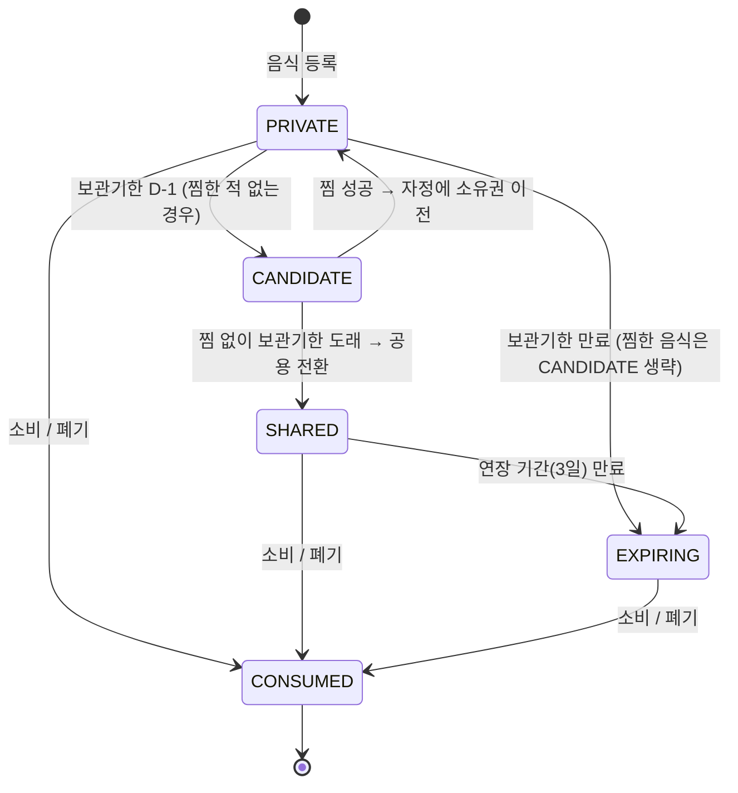
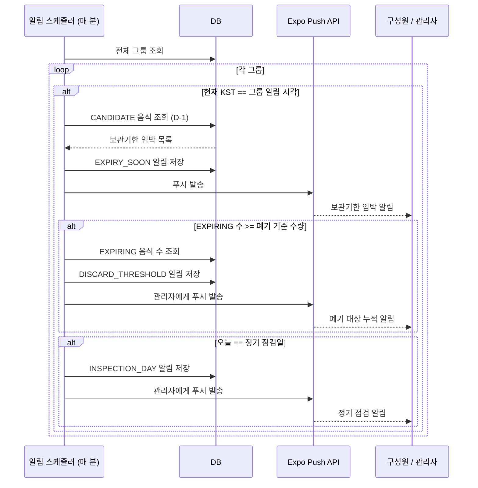

# Nangjanggo (냉장고)

구성원 모두가 함께 관리하는 스마트 냉장고 앱

---

## 서비스 개요

| 구분 | 내용 |
|------|------|
| **Target** | **공용 냉장고를 운영하는 시설의 관리자**<br>- 대학 기숙사 · 학생 식당 운영 교직원<br>- 호스텔 · 게스트하우스 운영자<br>- 공유 오피스 · 공유 주거 관리 담당자 |
| **Problem** | - 냉장고 속 식품 상태를 **관리자 혼자 파악**해야 하는 구조적 부담<br>- 보관기한이 지난 음식이 방치되어도 **구성원은 관여하지 않음**<br>- 누가 어떤 음식을 보관 중인지 **추적이 어려움**<br>- 폐기·공지 등 관리 업무가 **관리자에게 집중** |
| **Solution** | - 구성원이 직접 음식을 등록·관리하는 **참여형 냉장고 관리 시스템**<br>- 폐기 음식을 방치하면 냉장고 이용을 제한하는 **책임 유도 메커니즘**<br>- 관리에 기여한 구성원에게 포인트를 지급하는 **보상 시스템** |

---

## 서비스 상세 소개

### 핵심 기능

**구성원 (일반 사용자)**

| 기능 | 설명 |
|------|------|
| **라벨 출력 & 음식 등록** | 냉장고에 부착된 NFC 태그를 터치하면 라즈베리파이와 연동된 라벨 프린터가 자동으로 스티커를 출력. 스티커에는 소유자·보관일·보관기한·QR코드가 포함됨. 단, 본인 소유의 폐기 대상 음식이 남아 있으면 라벨 출력이 차단되며, 해당 음식을 먼저 소비하거나 폐기해야 함 |
| **AI 식재료 분석** | 음식 사진을 찍으면 Google Gemini가 품목명·보관기한·보관 주의사항을 자동으로 채워줌 |
| **찜하기** | 보관기한이 하루 남은 음식은 공용 전환 가능. 다른 구성원이 찜하면 자정에 소유권이 이전됨. 찜 성공 시 포인트 획득 |
| **음식 상태 확인** | QR코드 스캔으로 보관 중인 음식의 소유자·보관기한·상태를 즉시 조회 |
| **포인트 & 랭킹** | 음식 등록, 찜 참여, 제때 소비 등 냉장고 관리에 기여하면 포인트 획득. 그룹 내 월별 랭킹으로 집계되며, 관리자 재량하에 보상 가능 |
| **커뮤니티** | 그룹 내 게시글·댓글·좋아요로 구성원 간 소통 |

**관리자 (Admin)**

| 기능 | 설명 |
|------|------|
| **폐기 임박 알림** | 그룹 내 폐기 대상 음식이 설정한 기준 수량 이상이 되면 관리자에게 푸시 알림 발송 |
| **정기 점검일 알림** | 매달 지정한 날짜에 냉장고 점검 알림을 관리자에게 자동 발송 |
| **그룹 고급 설정** | 보관 기간·폐기 기준 수량·알림 시각(시:분)·랭킹 집계 주기 등 세부 설정 |
| **멤버 관리** | 구성원 강퇴, 역할 변경, 초대 코드 발급 |
| **운영자 페이지** | 전체 서비스 현황 조회 (앱 내 운영자 도구) |

### 음식 상태 라이프사이클

냉장고에 등록된 음식은 아래 상태 머신에 따라 자동으로 전환됩니다. 상태 전환은 매일 자정 KST에 실행되는 스케줄러가 처리합니다.



| 상태 | 의미 |
|------|------|
| `PRIVATE` | 본인 소유로 냉장고에 보관 중 |
| `CANDIDATE` | 보관기한 D-1, 찜 대기 상태 |
| `SHARED` | 찜하는 사람이 없어 공용 전환된 상태 |
| `EXPIRING` | 보관기한 만료, 폐기 대상. 이 상태인 음식이 있으면 새 음식 등록 불가 |
| `CONSUMED` | 소비 또는 폐기 완료 |

**알림 스케줄러 흐름**

매 분 실행되는 스케줄러가 그룹별 설정 시각(KST)과 현재 시각을 비교해 알림을 발송합니다.



---

## 사용 가이드

### 구성원 — 음식 등록

1. 냉장고에 부착된 NFC 태그를 스마트폰으로 터치
2. 앱이 자동으로 열리며 음식 등록 화면으로 이동
3. AI 분석 또는 직접 입력으로 품목명·보관기한 입력
4. 등록 완료 → 라즈베리파이가 라벨 프린터로 스티커 자동 출력
5. 출력된 스티커를 음식 용기에 부착 후 냉장고에 넣기

> 본인 소유의 폐기 대상 음식(EXPIRING)이 있으면 라벨 출력이 차단됩니다. 먼저 해당 음식을 소비하거나 폐기 처리해야 합니다.

### 관리자 — 라즈베리파이 최초 등록

라즈베리파이와 스마트폰이 **같은 와이파이**에 연결된 상태에서 진행합니다.

1. 앱 → 그룹 설정 → 기기 연동
2. 라즈베리파이의 **로컬 IP 주소**를 입력하고 등록
3. "등록되었습니다" 메시지 확인
4. 라즈베리파이 **전원을 껐다가 켜기**
5. 부팅 시 Cloudflare Tunnel이 자동 실행되며 EC2에 터널 주소가 등록됨
6. 이후 와이파이가 달라져도 앱 → 라즈베리파이 통신이 가능

---

## 기술 스택

| 영역 | 기술 |
|------|------|
| Frontend | React Native, Expo |
| Backend | Spring Boot 3.4.4, Java 21 |
| Database | MySQL 8.0 |
| Auth | Spring Security, JWT |
| Storage | AWS S3 |
| AI | Google Gemini API |
| Push | Firebase, Expo Notifications |
| Infra | Docker, AWS EC2 |
| CI/CD | GitHub Actions |
| Hardware | Raspberry Pi, 라벨 프린터, NFC |

---

## 하드웨어 구성

**Raspberry Pi + 라벨 프린터**를 냉장고에 연동해, 식재료 등록 시 자동으로 라벨을 출력합니다.

**라벨 출력 흐름**

```
모바일 앱에서 NFC 태그 터치
        │
        ▼
Spring Boot 서버 (EC2)
  - 음식 항목 생성
  - Raspberry Pi로 출력 명령 전송 (Cloudflare Tunnel)
        │
        ▼
Raspberry Pi → 라벨 프린터
  - 출력 내용: 음식 ID / 소유자 / 보관 기간
  - QR 코드: 앱 딥링크 (yangsimfridge://foods/{id})
```

---

## 프로젝트 구조

```
Nangjanggo/
├── backend/                        # Spring Boot 서버
│   └── src/main/java/com/nangjanggo/yangsim/
│       ├── user/                   # 회원 엔티티, 마이페이지
│       ├── auth/                   # 회원가입, 로그인, 이메일 인증
│       ├── group/                  # 그룹 생성/참여/멤버 관리
│       ├── fridge/                 # 냉장고 CRUD
│       ├── food/                   # 식재료 CRUD, AI 분석, 상태 스케줄러
│       ├── hardware/               # 라즈베리파이 연동
│       ├── printer/                # 라벨 프린터 출력
│       ├── notification/           # 푸시 알림
│       ├── community/              # 게시글, 댓글, 좋아요
│       ├── ranking/                # 랭킹 및 포인트
│       ├── admin/                  # 운영자 전용 API (전체 유저/그룹/음식 조회)
│       └── security/               # JWT 인증
│
├── frontend/                       # React Native 앱 (Expo)
│   └── src/
│       ├── core/
│       │   └── navigation/         # 앱 라우팅
│       ├── features/
│       │   ├── auth/               # 로그인, 회원가입, 비밀번호 재설정
│       │   ├── group/              # 그룹 관리, NFC 태그 쓰기
│       │   ├── fridge/             # 냉장고 및 식재료 화면, NFC 읽기
│       │   ├── food/               # 음식 등록, QR 스캔
│       │   ├── community/          # 게시글, 댓글
│       │   ├── notification/       # 알림 목록
│       │   ├── mypage/             # 내 정보 수정
│       │   ├── admin/              # 운영자 페이지
│       │   └── home/               # 홈 화면
│       └── shared/                 # 공통 컴포넌트, 상수, 유틸
│
└── (Hardware) Raspberry Pi         # 라즈베리파이 (별도 레포)
    ├── 라벨 프린터 제어 서버 (HTTP)
    ├── Cloudflare Tunnel로 외부 접속 허용
    └── NFC 태그 → 앱 딥링크 연동
```

---

## 아키텍처

**Client**
```
React Native + Expo (Android / iOS)
  ├── Firebase        — 푸시 알림
  └── REST API 통신  — Spring Boot 서버
```

**Server**
```
Spring Boot API Server (Docker, EC2)
  ├── MySQL 8.0       — 데이터 저장
  ├── AWS S3          — 이미지 저장
  ├── Google Gemini   — 식재료 AI 분석
  └── Raspberry Pi    — 라벨 프린터 제어 (Cloudflare Tunnel)
```

---

## DevSecOps / 배포

### CI/CD 파이프라인

`main` 브랜치에 push하면 변경된 영역(backend / frontend)에 맞는 워크플로우가 자동으로 실행됩니다.

**백엔드 (`backend/**` 변경 시)**

```
push to main
  │
  ├─ [test]  Gradle 테스트 + JaCoCo 커버리지 측정 → Codecov 업로드
  │
  └─ [build-and-deploy]  (test 통과 후)
       Docker 이미지 빌드
       → Docker Hub push
       → EC2 SSH 접속
       → docker compose pull & up -d --force-recreate
```

**프론트엔드 (`frontend/**` 변경 시)**

```
push to main
  │
  └─ Jest 테스트 → Expo EAS 빌드 세팅
       (Google Play Store 제출은 수동 실행)
```

### GitHub Secrets

워크플로우에서 사용하는 Secrets는 GitHub 저장소 Settings → Secrets and variables → Actions에서 등록합니다.

| Secret | 용도 |
|--------|------|
| `DOCKER_USERNAME` | Docker Hub 계정 |
| `DOCKER_PASSWORD` | Docker Hub 비밀번호 |
| `EC2_HOST` | EC2 퍼블릭 IP |
| `EC2_USER` | EC2 SSH 사용자명 |
| `EC2_SSH_KEY` | EC2 SSH 프라이빗 키 |
| `EXPO_TOKEN` | Expo EAS 인증 토큰 |

### 보안

- `backend/.env` — DB 자격증명·JWT 키·외부 API 키 보관. `.gitignore`에 포함되어 있으며 절대 커밋하지 않습니다.
- `@Profile("dev")` — 목 데이터 생성, 스케줄러 수동 실행 등 개발 전용 엔드포인트(`/dev/*`)는 `dev` 프로파일에서만 활성화됩니다. 프로덕션 배포 시 자동으로 비활성화됩니다.
- JWT — Access Token은 HTTP Authorization 헤더로 전달되며, 서버에 저장하지 않습니다.

---

## 시작하기

### 사전 요구사항

- Java 21
- Node.js 18+
- Docker & Docker Compose
- Expo CLI (`npm install -g expo-cli`)

### 환경 변수

`backend/.env`

```env
# MySQL
DB_USERNAME=
DB_PASSWORD=
DB_ROOT_PASSWORD=

# JWT 서명 키
JWT_SECRET=

# Gmail SMTP (이메일 인증 발송)
MAIL_USERNAME=
MAIL_PASSWORD=

# AWS S3 (이미지 저장)
AWS_ACCESS_KEY=
AWS_SECRET_KEY=
AWS_S3_BUCKET=
AWS_REGION=

# Google Gemini (식재료 AI 분석)
GEMINI_API_KEY=
```

`frontend/.env`

```env
# 백엔드 서버 주소
EXPO_PUBLIC_API_URL=
```

### 백엔드 실행

```bash
cd backend
docker-compose up --build
```

또는 로컬에서 직접 실행:

```bash
cd backend
./gradlew bootRun
```

### 프론트엔드 실행

```bash
cd frontend
npm install
npx expo start
```

---

## 팀원

| 학과 | 학번 | 이름 | 역할 |
|------|------|------|------|
| 소프트웨어학과 | 202020739 | 이기훈 (팀장) | Backend |
| 수학과 | 202127325 | 서지원 | Backend |
| 소프트웨어학과 | 202126839 | 김도형 | Frontend |
| 소프트웨어학과 | 202126861 | 김영빈 | Frontend |
